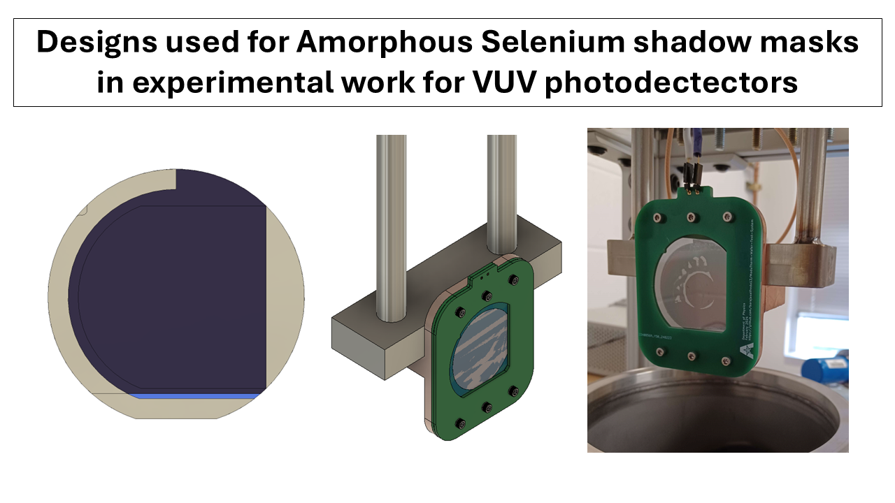
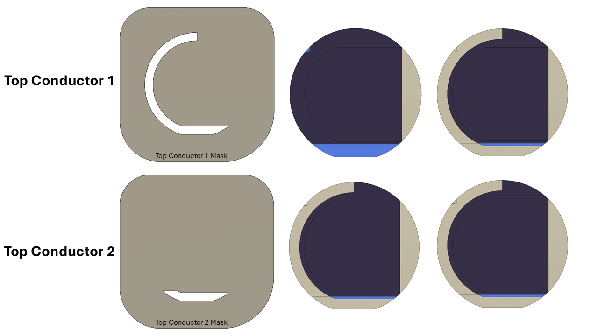

---
# Provided Assets
---
**NOTE** : Please be mindful of the units in your preferred CAD programs. Drawings are provided to verify dimensions used

| Component | Material | Known Purchase Site |
| --- | --- | --- |
| Mask | 316L Stainless Steel | [McMaster-Carr](https://www.mcmaster.com/) |
| Silicon Wafer | Silicon | [WaferPro](https://waferpro.com/silicon-wafers/) |
| Mask Holder | 316L Stainless Steel | [McMaster-Carr](https://www.mcmaster.com/) |

---
# Steps for Mask Usage
---

|  | Description | Output |
| --- | --- | --- | 
| Base Conductor Mask | A thin conductor is deposited through "**Base Conductor Mask**" | Thin film plane is created | 
| Test Material       | Desired sample of thin film deposited through "**Test Material Mask**" | Thin film sample is created |
| Top Conductor 1     | A thin conductor is deposited through "**Top Conductor 1**" | Thin film transport region is created |
| Top Conductor 2     | A desired film thickness is created for mechanical contact through "**Top Conductor 2**" | Contact film is deposited |

