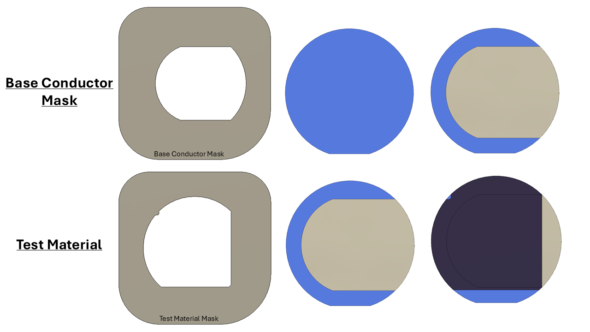
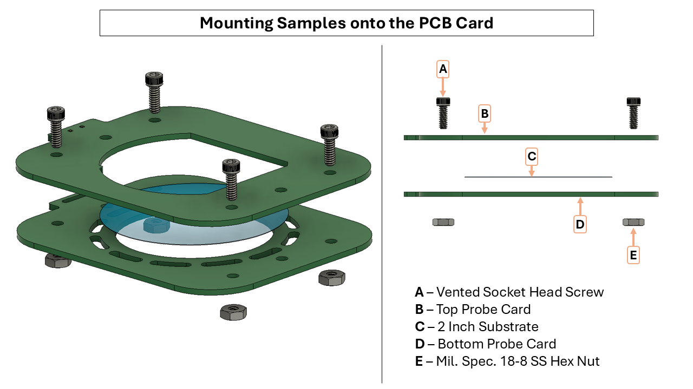
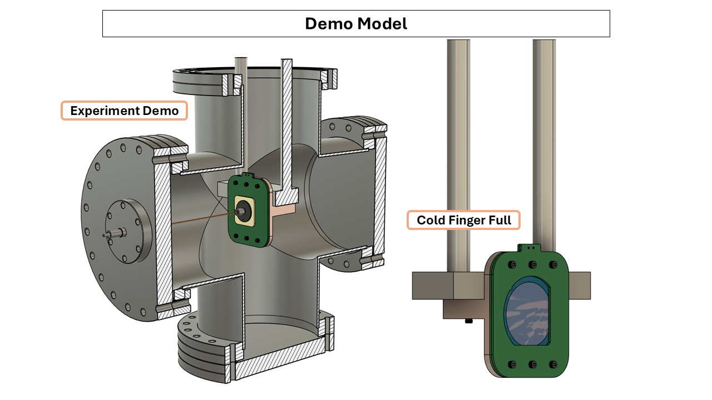
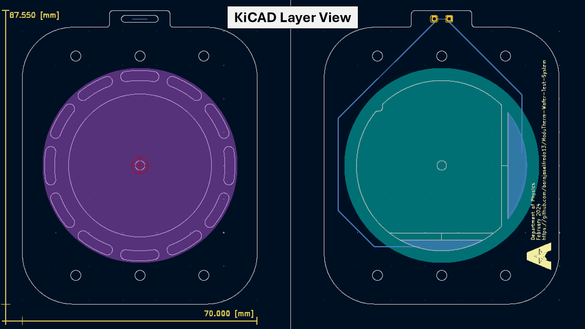

**NOTE** : Please be mindful of the units in your preferred CAD programs. Drawings are provided to verify dimensions used

| Component | Material | Purchase Site For Material |
| --- | --- | --- |
| Mask | 316L Stainless Steel | [McMaster-Carr](https://www.mcmaster.com/) |
| Silicon Wafer | Silicon | [WaferPro](https://waferpro.com/silicon-wafers/) |
| Mask Holder | 316L Stainless Steel | [McMaster-Carr](https://www.mcmaster.com/) |

# Masks
---

|  | Description | Output |
| --- | --- | --- | 
| Base Conductor Mask | A thin conductor is deposited through "**Base Conductor Mask**" | Thin film plane is created | 
| Test Material       | Desired sample of thin film deposited through "**Test Material Mask**" | Thin film sample is created |
| Top Conductor 1     | A thin conductor is deposited through "**Top Conductor 1**" | Thin film transport region is created |
| Top Conductor 2     | A desired film thickness is created for mechanical contact through "**Top Conductor 2**" | Contact film is deposited |

### Mask Procedure

### :: Screws and Nuts Used [McMasterr](https://www.mcmaster.com/) ::  
| Quantity | Item Number   | Description                                  |
|----------|---------------|----------------------------------------------|
| 6        | 93235A107     | Vented Socket Head Screw                     |
| 4        | 93235A114     | Vented Socket Head Screw                     |
| 4        | 91240A005     | Mil. Spec. 18-8 Stainless Steel Hex Nut      |

| Feature       | Information                                                                                                                        |
|---------------|------------------------------------------------------------------------------------------------------------------------------------|
| Dimensions    | x-70 mm y-87.55 mm                                                                                                                 |
| Thickness     | 1.6 mm                                                                                                                             |

## Aknowledgements

:: **Simulation and Feedback** ::  
Iakovos Tzoka  
https://www.linkedin.com/in/iakovos-tzoka-401207224  
  
:: **Supervision** ::   
Dr. Varghese Chirayath  
https://www.uta.edu/academics/faculty/profile?username=chirayat  
